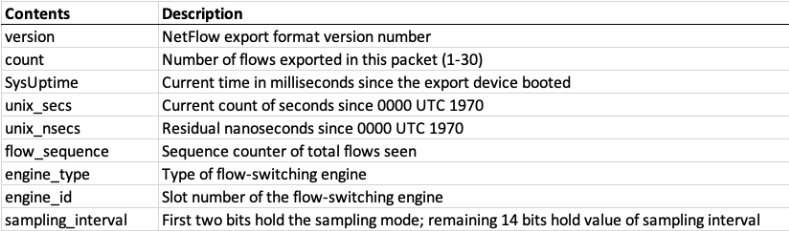
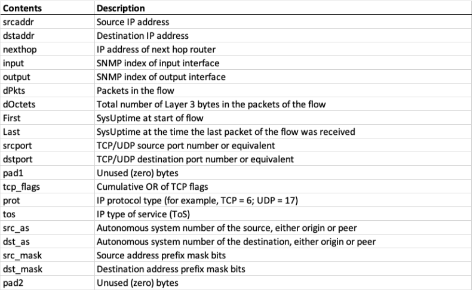
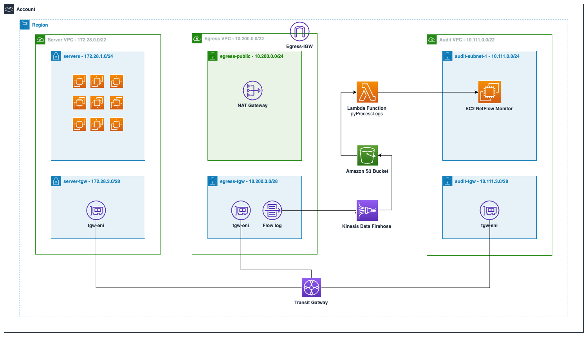

# Amazon VPC FlowLogs to a NetFlow v5 Receiver

This repository shows an example of [AWS Lambda](https://aws.amazon.com/lambda/) python code that reads [Amazon VPC FlowLogs](https://docs.aws.amazon.com/vpc/latest/userguide/flow-logs.html) and converts them into [NetFlow](https://en.wikipedia.org/wiki/NetFlow) v5 compatible packets. 

NetFlow packets are broken into two main parts. The first part is the header (*Image 1*) which includes information about the device and some information about the rest of the payload (number of flows in this packet etc). The second part is the data (*Image 2*) regarding the actual flows that have been captured.

*Image 1*


*Image 2*


## WARNING

**This code is not production ready. It's an example of what is possible.**

## Usage

1. Configure VPC Flow Logs in the correct format (see VPC Flow Log Format [below](#vpc-flowlog-format))
2. Configure VPC Flow Logs to store the logs as a GZIP compressed file stored in a [Amazon Simple Storage Service (Amazon S3)](https://aws.amazon.com/s3/) bucket. You can either save the flow logs directly to Amazon S3 (~10 minute delay) or push them through a [Amazon Kinesis Data Firehose](https://aws.amazon.com/kinesis/data-firehose/) stream (~1 minute delay)
3. Deploy the Lambda code. 
   - Tested using Python 3.10
   - Review the amount of memory allocated to the Lambda function. You may need to increase this depending on how long the function takes to process your flow log files
     - Example: *I used a function with 128MB memory. It processed a 100Kb gzip compressed flow log containing approximately 6100 entries. The function consumed 78MB ram and took 4.3 seconds to run. Increasing the Lambda memory would speed up the runtime of the function to a point. It's best to test this in your environment to pick a suitable size. These changes could impact the Lambda charges - see the [pricing page](https://aws.amazon.com/lambda/pricing/) for further detail*
   - Review the timeout setting for the Lambda function and increase if needed
   - Ensure that the Lambda function is deployed into a VPC that can reach your NetFlow v5 receiver. You will also need to configure a [Security Group](https://docs.aws.amazon.com/vpc/latest/userguide/security-groups.html) as well as any firewalls/Network ACLs you might have. When doing this make it as restrictive as possible. Just allow the Lambda function to access the NetFlow v5 port on the receiver and nothing else. Typically NetFlow listens on UDP 2055 however your configuration could differ.
   - Ensure that the Lambda function has the right permissions to access the S3 bucket being used to store your VPC Flow Logs. An example on how to configure that can be found here - https://repost.aws/knowledge-center/lambda-execution-role-s3-bucket
   - Update the code and fill in your details for the following global variables:
     - ```netflow_receiver_address``` - set to the IP address or DNS name of your Netflow v5 receiver
     - ```netflow_receiver_port``` - set to the port used by your Netflow v5 receiver
4. Configure a mechanism to notify your Lambda function of any file changes. I used [S3 event notifications](https://docs.aws.amazon.com/AmazonS3/latest/userguide/enable-event-notifications.html). I filtered my notifications to only notify when a specific folder receives a PUT request for files ending .gz.  When the bucket is updated with a new log file, S3 notifies my Lambda function. Within the event data it sends the details of the S3 bucket and file that was added.
   - If you choose another mechanism then you will need to change the Lambda code appropriately

### VPC FlowLog Format

The VPC Flow Log default format lacks a couple of important fields that I use. These fields are:
- TCP Flags
- pkt_srcaddr
- pkt_dstaddr

The last two options are important because flow logs capture traffic flowing to and from interfaces. Depending on how your network infrastructure is configured the default source and destination fields might show interface addresses for other services. For example a Transit Gateway Attachment interface or the interface of a NAT Gateway. This would lead to an inconsistent experience when monitoring traffic flows. This is where the pkt_srcaddr and the pkt_dstaddr come in. These fields contain the original source/destination address of the packet.

To add these fields in you will need to utilise a [custom VPC FlowLog format](https://docs.aws.amazon.com/vpc/latest/userguide/flow-logs.html#flow-log-records). 

The format I've used looks like this:

```${version} ${account-id} ${interface-id} ${srcaddr} ${dstaddr} ${srcport} ${dstport} ${protocol} ${packets} ${bytes} ${start} ${end} ${action} ${log-status} ${tcp-flags} ${pkt-srcaddr} ${pkt-dstaddr} ${flow-direction}```

If you change the format including the order of the fields then the code will need to be altered to match. This is because the code just does a simple ```split(' ')``` on each line of the VPC Flow Log and expects the fields in the correct order. 

## Known Issues/Limitations

1. This code was designed and tested against the NetFlow v5 format. It requires updating to work with the later formats.
2. This code has little to no error handling, it's just proof of concept code. You will need to add in some error handling.
3. The NetFlow flowsequence number is currently always set to 1. This works but isn't ideal. One method to fix this would be to send the S3 event notifications to a SQS FIFO queue. The SQS queue would empty at a rate of 1, calling the Lambda function. The Lambda function would be updated to store the current flowsequence such as [Amazon DynamoDB](https://aws.amazon.com/dynamodb/) (Review DynamoDB [costs](https://aws.amazon.com/dynamodb/pricing/) especially if you have large amounts of network traffic to process) so that it can be updated correctly. (flowsequence is a 32-bit integer, which is 4,294,967,295 (2^32 - 1) in size so it'll need to be reset).

## Example Architecture

The following architecture diagram illustrates a way in which you could use this sample code. This architecture shows a single AZ setup using a centralised egress via Transit Gateway.



- VPC Flow Logs have been configured on the transit gateway subnet within our egress VPC. This means all traffic passing through this subnet will be captured by our flow logs
- The VPC Flow Logs are sent onwards to a Kinesis Data Firehose
- Kinesis Data Firehose processes the flow logs and writes them to a S3 bucket
- S3 notifies our Lambda function which reads the newly written logs from S3, processes them into NetFlow v5 packets and forwards them on to our NetFlow v5 Receiver

## Security

Ensure the IAM roles used by the Lambda function are as restrictive as possible. The Lambda function requires access to read files from a specific S3 bucket and then remove them. 

If you don't want the function to remove the files then comment out line 197

```s3_client.delete_object(Bucket=bucketName, Key=fileName)```

See [CONTRIBUTING](CONTRIBUTING.md#security-issue-notifications) for more information.

## Author

[Gareth Hastings](https://www.linkedin.com/in/gareth-hastings-8482aa43/)

## License

This same code is licensed under the MIT-0 License. See the LICENSE file.

